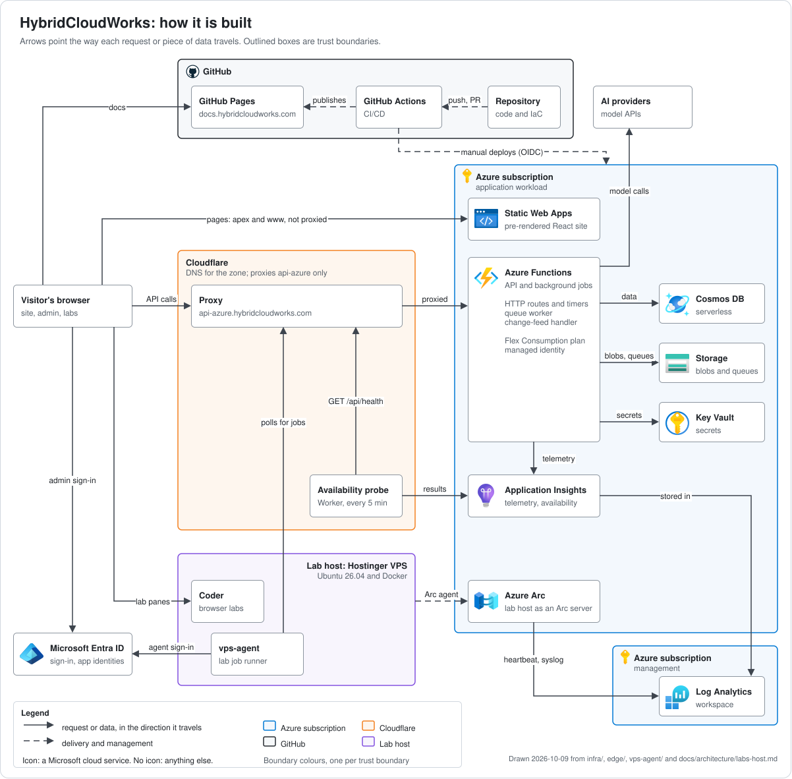

# HybridCloudWorks

[](https://github.com/saulpatinojr/HCW-HybridCloudWorks/actions/workflows/ci.yml)
[](https://github.com/saulpatinojr/HCW-HybridCloudWorks/actions/workflows/codeql.yml)
[](https://github.com/saulpatinojr/HCW-HybridCloudWorks/actions/workflows/docs-pages.yml)
[](https://coderabbit.ai)
[](https://qlty.sh/gh/saulpatinojr/projects/HCW-HybridCloudWorks)
[](https://qlty.sh/gh/saulpatinojr/projects/HCW-HybridCloudWorks)

[](https://hybridcloudworks.com)
[](https://docs.hybridcloudworks.com)
[](https://github.com/saulpatinojr/HCW-HybridCloudWorks/blob/main/LICENSE)
[](https://github.com/saulpatinojr/HCW-HybridCloudWorks/commits/main)

HybridCloudWorks is a website for cloud architects, engineers and learners,
live at [hybridcloudworks.com](https://hybridcloudworks.com). It brings
architecture guidance, reference designs, certification study material,
planning tools and hands-on labs for Azure, AWS, Google Cloud, VMware, GitHub,
FinOps, Terraform, Docker and Ansible together in one place.

This repository holds everything behind the site: the web application, its
API, the infrastructure as code, the lab host's configuration and the
engineering documentation, which is published at
[docs.hybridcloudworks.com](https://docs.hybridcloudworks.com).

## What the site offers

- **Provider hubs.** One hub per platform, with news, articles and learning
  paths and, depending on the platform, architecture designs, frameworks, a
  podcast, code samples, modules or tools.
- **Planning tools.** A resource comparison, a decision matrix, a pricing
  comparison, a migration hub, and a Landing Zone Builder that writes
  Terraform for an Azure landing zone from Azure Verified Modules.
- **Browser labs.** Guided exercises that open a code-server workspace in a
  pane on the site, running on the project's own lab host.
- **An admin portal**, behind Microsoft Entra ID sign-in, where content is
  written, reviewed, scheduled and published, and where integrations, AI
  settings, labs and platform health are managed.

## How it is built

The public pages are React, pre-rendered at build time and served by Azure
Static Web Apps. The site's data and its background jobs go through one Azure
Functions app, which keeps the data in Cosmos DB and Azure Storage and reads
its secrets from Key Vault. Cloudflare is the DNS for the domain and proxies the API hostname
only; the site and the docs resolve straight to Azure and GitHub Pages. A lab
host outside Azure runs the browser labs and the lab job runner, and reports
to Azure through Azure Arc.



The diagram is drawn in draw.io with the official Azure icons; its source is [`docs/assets/architecture/hcw-architecture.drawio`](docs/assets/architecture/hcw-architecture.drawio). Edit that file in draw.io and export it again as SVG, rather than editing the SVG.

The same picture in words:

- The browser loads pages from Azure Static Web Apps and calls the API at
  `api-azure.hybridcloudworks.com`, the one hostname Cloudflare proxies.
- The API is a single Azure Functions app on the Flex Consumption plan: HTTP
  routes, timers, a queue worker and Cosmos DB change-feed handlers. It uses
  its managed identity for Cosmos DB, Storage and Key Vault, and calls AI
  model providers (Microsoft Foundry and third-party model APIs) for the
  content features.
- Admins sign in with Microsoft Entra ID, and the API checks their tokens on
  every admin call.
- The lab host runs Coder, whose workspaces open in panes on the site, and
  `vps-agent`, which polls the API for lab jobs and runs each one in a
  container with no network.
- A Cloudflare Worker checks the API's health every five minutes and reports
  each result to Application Insights, where an alert watches it.

| Layer | Technology |
| --- | --- |
| Website | React 19, Vite, Tailwind CSS and React Router, pre-rendered at build time |
| Hosting | Azure Static Web Apps |
| API and background jobs | Azure Functions (Flex Consumption) on Node.js 24 |
| Data | Azure Cosmos DB (serverless), Azure Blob and Queue Storage |
| Identity and secrets | Microsoft Entra ID, managed identities, Azure Key Vault |
| Edge | Cloudflare DNS, proxy and a Worker probe |
| Observability | Application Insights, Log Analytics and Azure Monitor alerts |
| Infrastructure as code | Terraform, planned and applied in HCP Terraform |
| Lab host | Ubuntu 26.04 on a Hostinger VPS, configured with Ansible: Docker, Caddy, Coder and Azure Arc |
| Delivery | GitHub Actions on GitHub-hosted runners, signing in to Azure with OIDC |
| Documentation | MkDocs with the Material theme, on GitHub Pages |

The reasoning behind each choice is in the
[architecture decision records](docs/decisions/index.md).

## Repository map

| Path | What it holds | Read more |
| --- | --- | --- |
| [`frontend/`](frontend/) | The public website and the admin portal: React, Vite, the pre-renderer, unit tests and Playwright browser tests | [ADR 0007](docs/decisions/0007-static-first-frontend.md) |
| [`functions/`](functions/) | The Azure Functions API: HTTP routes, timers, the queue worker, change-feed handlers and their tests | [ADR 0019](docs/decisions/0019-single-function-app.md) |
| [`infra/`](infra/) | Terraform for the Azure estate and the Cloudflare records in front of it | [README](infra/README.md) |
| [`infra-lab/`](infra-lab/) | Terraform that adopts the lab host and writes its DNS records | [README](infra-lab/README.md) |
| [`lab-host/`](lab-host/) | Ansible that configures the lab host: hardening, Docker, Caddy, Coder, the job runner and Azure Arc | [README](lab-host/README.md) |
| [`lab-image/`](lab-image/) | The `hcw-lab` container images that lab jobs and workspaces run in, published to Docker Hub | [README](lab-image/README.md) |
| [`vps-agent/`](vps-agent/) | The lab job runner: polls the API, runs each job in a sandboxed container and reports the result | [Labs host](docs/architecture/labs-host.md) |
| [`edge/`](edge/) | The Cloudflare Worker that probes the API's availability | [Availability probe](docs/runbooks/availability-probe.md) |
| [`scripts/`](scripts/) | Operations tooling and its tests: deployment smoke checks, monitors, content manifests, restore and bootstrap scripts, the docs-site build hook, and tests that hold workflows and Terraform to the repository's rules | — |
| [`docs/`](docs/) | The documentation source: decisions, architecture, runbooks, standards, articles and history | [Docs site](https://docs.hybridcloudworks.com) |
| [`.github/`](.github/) | Workflows, issue and pull request templates, and the contributing, security, support and conduct policies | [CONTRIBUTING](.github/CONTRIBUTING.md) |
| [`.azure/`](.azure/) | Machine-readable contracts: the API surface the website depends on, and the approved infrastructure plan | — |
| [`.vscode/`](.vscode/) | The Azure Functions dev loop for VS Code: tasks that start the Functions host and a launch configuration that attaches the debugger | — |
| [`.qlty/`](.qlty/) | Configuration for Qlty, which reports maintainability and coverage | — |
| `.claude/`, `hooks/`, `tooling/` | The agent harness that Claude Code sessions in this repository use | — |

At the root, [CHANGELOG.md](CHANGELOG.md) records completed work,
[TODO.md](TODO.md) records the accepted risks, and `mkdocs.yml` configures
the docs site. Open work is tracked as
[GitHub issues](https://github.com/saulpatinojr/HCW-HybridCloudWorks/issues).

## Run it locally

You need Git and Node.js 26 with npm 10 or later. The API in `functions/`
runs on Node.js 24, the newest line Azure Functions Flex Consumption
supports. The docs site needs Python 3.14, infrastructure work needs
Terraform 1.16, and the lab image needs Docker. The oldest release of each
that the repository accepts is in `scripts/version-floors.json`, which a
weekly workflow re-checks, and CI fails a pin below it.

Each Node.js package installs and tests the same way, from its own directory:

| Package | Node.js | Install | Test | Also run by CI | Start locally |
| --- | --- | --- | --- | --- | --- |
| `frontend/` | 26 | `npm ci` | `npm test` | `npm run lint`, `npm run format:check`, `npm run build` | `npm run dev` |
| `functions/` | 24 | `npm ci` | `npm test` | `npm run lint` | `npm start` |
| `scripts/` | 26 | `npm ci` | `npm test` | `npm run lint` | — |
| `vps-agent/` | 26 | `npm ci` | `npm test` | — | `npm start` |
| `edge/availability-probe/` | 26 | `npm ci` | `npm test` | — | — |
| `lab-host/coder/` | 26 | — (no dependencies, so no lockfile) | `npm test` | `bash compose-config-check.sh`, and `terraform fmt`, `init` and `validate` on the workspace template | — |

For example, the website, in PowerShell or bash alike:

```shell
cd frontend
npm ci
npm test
npm run dev
```

Vite prints the local address to open. A few packages need more than that:

- **Website.** For a session that talks to an API and lets you sign in,
  copy `frontend/.env.example` to `frontend/.env` and fill in its values.
  Every `VITE_` variable is built into the public bundle, so never put a
  secret in one. The Playwright browser suites run with `npm run test:e2e`
  after `npx playwright install chromium`.
- **API.** `npm start` runs `func start`, which needs
  [Azure Functions Core Tools](https://learn.microsoft.com/azure/azure-functions/functions-run-local)
  and a `functions/local.settings.json` copied from
  `local.settings.json.example`. The example points at local storage and
  Cosmos DB emulators.
- **Lab job runner.** `npm start` runs `node index.js`, which reads the
  variables named in `vps-agent/.env.example` from its environment. They
  include the agent's own Entra identity and certificate, so in practice it
  runs on the lab host as a service, and its tests are the way to work on it
  elsewhere.
- **Infrastructure.** Plans and applies run only in HCP Terraform. The
  formatting, validation and test checks you can run without credentials are
  in [infra/README.md](infra/README.md) and
  [infra-lab/README.md](infra-lab/README.md).
- **Lab host and lab image.** The playbook runs on the lab host itself, as
  [lab-host/README.md](lab-host/README.md) explains. The images build with
  Docker and carry their own smoke tests, listed in
  [lab-image/README.md](lab-image/README.md).

### Documentation site

The site builds from `docs/` with the pinned MkDocs in
`scripts/docs/requirements.txt`. From the repository root:

```shell
python -m pip install -r scripts/docs/requirements.txt
python scripts/docs/check_redaction.py
mkdocs build --strict
```

`mkdocs serve` previews it locally. The build also publishes this README,
the changelog and the TODO file, so links in them are written relative to the
repository root and work both on GitHub and on the site.

## Continuous integration and delivery

Every pull request runs these workflows, all on GitHub-hosted runners:

- **CI** ([`ci.yml`](.github/workflows/ci.yml)): a lockfile-strict install
  and the tests for each Node.js package, plus that package's own checks from
  the table above (lint for `frontend/`, `functions/` and `scripts/`, and the
  format check and build for `frontend/` alone); ansible-lint and a syntax
  check for the lab host; checks for the Coder workspace template; tests for
  the agent harness; and the Playwright browser suites as an advisory job. A
  job whose component did not change skips its heavy steps and still
  reports.
- **CodeQL** for JavaScript and TypeScript, GitHub Actions and Python.
- **IaC Validation**: `terraform fmt`, `terraform validate`, TFLint and a
  Trivy misconfiguration scan for `infra/` and `infra-lab/`.
- **Repository Policy**: the layout and documentation rules in
  `scripts/validate-repository-structure.ps1`.
- **Dependency review**, **Coverage** and **Complexity Delta**.
- **Docs site**, when documentation changes: the redaction gate and
  `mkdocs build --strict`.
- **Publish lab image**, when the lab image or what it depends on changes: a
  build and smoke test of both images.

Delivery always involves a person. The site and the API deploy through
workflows that are started by hand and sign in to Azure with OIDC rather than
a stored credential. Terraform changes are planned in HCP Terraform and
applied only after someone reviews the plan. The docs site deploys to GitHub
Pages when a merge to `main` changes `docs/`, `mkdocs.yml`, `scripts/docs/`,
this README, the changelog, the TODO file or the workflow itself. Scheduled
workflows watch delivery health, unresolved secrets, published pages and
pinned versions.

## Documentation

[docs.hybridcloudworks.com](https://docs.hybridcloudworks.com) is the
engineering record: [architecture decisions](docs/decisions/index.md),
[runbooks](docs/runbooks/deployment-runbook.md),
[standards](docs/standards/naming-convention.md) and the architecture and
cost reviews. Its source is [`docs/`](docs/), reviewed through pull requests
like the code. How the platform was first built, including its move to
Azure, is kept as [history](docs/history/migration-plan.md).

## Contributing

Read [CONTRIBUTING](.github/CONTRIBUTING.md) before your first pull request.
It says where each kind of document belongs, how a change moves from branch
to merge, and the extra rules for infrastructure. In short:

- Work is tracked as
  [GitHub issues](https://github.com/saulpatinojr/HCW-HybridCloudWorks/issues).
  To report a problem or suggest a change, open one from the
  [issue templates](https://github.com/saulpatinojr/HCW-HybridCloudWorks/issues/new/choose).
- Every change arrives as a pull request that follows the template, with CI
  green.
- Narrative documentation goes under `docs/`, not beside the code.

Everyone taking part follows the [code of conduct](.github/CODE_OF_CONDUCT.md).
For where to ask for help, see [SUPPORT](.github/SUPPORT.md).

## Security

Report a vulnerability privately, as [SECURITY](.github/SECURITY.md)
describes, never in a public issue.

## Licence

The code is licensed under the Apache License, Version 2.0; the text is in
[LICENSE](LICENSE). [NOTICE](NOTICE) carries the copyright line and explains
that third-party names, logos and marks, such as the vendor logos under
`frontend/public/icons/providers/` and `frontend/src/assets/brands/`, belong
to their owners and are not licensed under Apache-2.0. Other third-party
material, such as the fonts under `frontend/public/fonts/`, keeps its own
licence terms.
