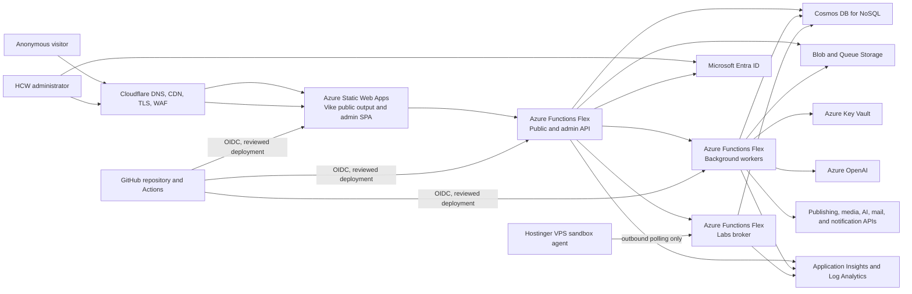
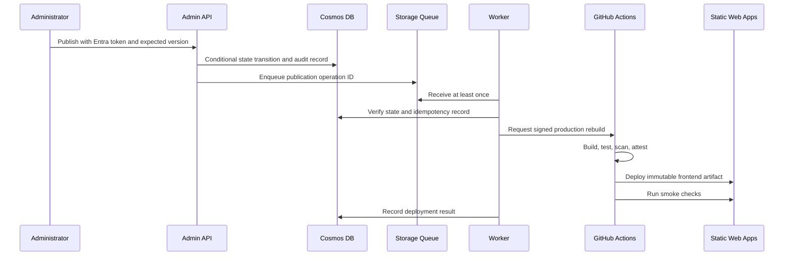

# HybridCloudWorks Azure Target Architecture

**Status:** Draft for architecture approval

**Decision scope:** Production target state and migration boundaries

**Source workload:** `C:\Users\saulp\Workspace\Personal-Site_HCW`

**Target repository:** `C:\Users\saulp\Workspace\HCW-HybridCloudWorks`

## 1. Outcome and constraints

HybridCloudWorks will move from Firebase/GCP into this repository and become a static-first Azure
workload. After verified cutover, the old repository will be archived. The architecture is designed
for one production environment, a generic Azure tenant and subscription, and an initial monthly
Azure ceiling of **USD 150**.

The five Azure Well-Architected pillars are first-class design requirements:

1. Reliability
2. Security
3. Cost Optimization
4. Operational Excellence
5. Performance Efficiency

The public site remains anonymous. Microsoft Entra ID protects the administrative plane only.
Cloudflare remains authoritative DNS and the initial CDN/WAF because Azure Front Door has a larger
fixed-cost footprint. Tenant IDs, subscription IDs, regions, domains, object IDs, model names, and
resource suffixes remain parameters.

## 2. Workload inventory

The source is substantially larger than the current Azure attempt. The migration scope includes:

- Vike-prerendered public pages and the React administrative SPA;
- editorial ingestion, inspection, review, publishing, media, schedules, and audit history;
- Firestore collections, indexes, security rules, and public/admin query contracts;
- Firebase Storage media and generated assets;
- HTTP, scheduled, Firestore-triggered, and callable Cloud Functions;
- ContentForge and multi-provider AI routing;
- RSS ingestion, link monitoring, image processing, and content grading;
- Publer, Plaud, Telegram, Klaviyo, Linkie, GitHub, YouTube, Firecrawl, Replicate, and other external
  integrations;
- cloud comparison/migration tools and report exports;
- Hostinger-based Terraform and Ansible lab execution;
- GitHub Actions, security checks, deployment automation, and operational scripts.

The existing Azure code is treated as a prototype. Its useful adapters and migration scripts can be
retained, but its current service coverage, key-based access, public storage, authentication
contradictions, and one-to-one container assumptions are not accepted as the target architecture.

## 3. System context



## 4. Component topology

### 4.1 Edge and frontend

Cloudflare continues to own authoritative DNS, TLS edge termination, caching, DDoS protection, and
the WAF capabilities available in the selected Cloudflare plan. Azure Static Web Apps Standard hosts
the generated Vike output and dynamic admin shell.

Public navigation must not require a live Cosmos DB query. Published content is materialized during
the build into static HTML and versioned public data. Content publication triggers a controlled
GitHub rebuild. If the API, Cosmos DB, an AI provider, or an integration is unavailable, already
published pages remain readable.

The admin JavaScript bundle is not considered secret. Every admin data read or mutation is enforced
at the API with an Entra token and an application role or group claim.

### 4.2 Compute boundaries

Three Functions Flex Consumption applications provide independent identities, permissions,
deployments, and scaling:

| Component | Responsibility | Access profile |
| --- | --- | --- |
| API | Public tools, admin reads and mutations, health endpoints | Internet-facing; admin routes require Entra; public routes explicitly allowlisted |
| Worker | Schedules, change feed, queues, AI, media, publishing, notifications, third-party sync | No public business endpoints; privileged secrets and data access |
| Labs broker | Job admission, quota, status, and Hostinger agent coordination | Narrow public surface; isolated Cosmos container permissions |

Handlers are stateless, idempotent, and safe for at-least-once delivery. External side effects use an
operation ID, bounded exponential retry, explicit terminal state, and poison queues. Synchronous HTTP
requests do not perform long-running publishing or media work.

Always-ready instances start at zero. They can be enabled only after latency telemetry demonstrates a
need and the monthly forecast remains below the budget threshold.

### 4.3 Data plane

Cosmos DB for NoSQL Serverless is the initial transactional store. Session consistency aligns with
the interactive editorial workflow. Availability-zone support and continuous backup are enabled in a
compatible primary region.

The existing Terraform container list is not authoritative. Before implementation, every Firestore
collection is classified by owner, visibility, query shapes, write rate, retention, and transaction
boundary. Partition keys must be stable and high-cardinality. Fields such as `status` are not valid
partition keys for high-churn containers such as lab jobs.

Initial logical data domains are:

| Domain | Examples | Access pattern |
| --- | --- | --- |
| Editorial | content, blogs, templates, recordings, schedules, snapshots | Admin writes; public materialized output |
| Media | generated images, gallery, certifications, speaker events | Metadata in Cosmos; binaries in Blob Storage |
| Operations | workflow alerts, audits, digests, dashboard statistics | Worker writes; admin reads |
| Social and integrations | social posts, Publer sync, Plaud ingest, newsletters | Idempotent worker ownership |
| Cloud tools | workspaces, assessments, architecture plans, exports, catalog/cache | Explicit public/admin ownership model |
| Labs | jobs, agents, quotas | Short TTL, bounded payloads, isolated broker identity |
| Configuration | site settings, providers, prompt sets, MCP servers | Public projection or admin-only source data |

Azure Storage GPv2 holds private media, migration exports, report artifacts, and queues. Anonymous
container access and shared-key application access are disabled. Public assets are delivered through
the site build or an explicitly controlled delivery path.

### 4.4 Identity and secrets

- One Entra SPA registration represents the admin client.
- One Entra API registration exposes admin scopes/app roles.
- An Entra group or application role identifies approved administrators.
- Function Apps use independent system-assigned managed identities.
- Cosmos DB, Storage, Key Vault, and Azure OpenAI use data-plane RBAC instead of account keys.
- TLS 1.2 or newer protects data in transit, and Microsoft-managed keys protect data at rest; no
  customer-managed-key requirement exists for the initial data classification.
- GitHub plan and apply jobs use separate user-assigned identities with federated credentials.
- The normal apply identity cannot grant itself permissions or change its OIDC trust.
- Key Vault uses Azure RBAC, purge protection, 90-day soft delete, and audit diagnostics.
- Third-party credentials remain in Key Vault and are retrieved only by the worker or specifically
  authorized API identity.

No Azure client secret, storage key, Cosmos key, saved Terraform plan, state file, or provider API key
is stored in GitHub source.

### 4.5 Network

The production VNet uses separate subnets for Functions integration and private endpoints. Flex
Consumption requires its integration subnet to be delegated to `Microsoft.App/environments`; that
subnet cannot also carry the originally proposed service-endpoint design. Selective private endpoints
therefore protect Cosmos DB, content Blob/Queue Storage, and Key Vault, with the associated Private DNS
zones linked to the VNet.

Function host storage remains public at the service endpoint initially because fully privatizing Blob,
Queue, and Table access for three host accounts would add disproportionate endpoint cost. These
isolated accounts contain only runtime/deployment state, never editorial content or integration
secrets, and use identity-first access wherever the Functions host supports it. Private endpoints for
host storage and Azure OpenAI remain measured hardening options.

The Static Web App and HTTP Function origins remain public services. Cloudflare fronts their custom
domains. Admin API authorization is never delegated solely to Cloudflare. Azure Front Door Premium is
the future option if private origin connectivity becomes a requirement; its current fixed price is
outside this workload's budget.

No Azure Firewall, NAT Gateway, VPN Gateway, Bastion, or public IP resource is required initially.
Deterministic egress becomes a separate decision if a third party requires source-IP allowlisting.

## 5. Critical flows

### 5.1 Publish flow



### 5.2 Third-party synchronization

Publer, Plaud, Telegram, Klaviyo, Linkie, GitHub, YouTube, and other integrations execute in the worker
boundary. Each integration has:

- a canonical local record and stable external ID;
- an operation ID and sync origin to prevent loops;
- normalized timestamps and explicit status mapping;
- retry count, last attempt, next attempt, and terminal error state;
- partial-failure behavior and reconciliation jobs;
- audit telemetry without credential or content leakage.

Read-only connectivity checks do not prove create, update, reschedule, or delete propagation. External
mutation tests require an explicitly disposable record and separate approval.

### 5.3 Labs flow

The browser submits a bounded lab request to the labs broker. The broker validates content, enforces
quota, creates a TTL-bound job, and returns an opaque ID. The Hostinger agent polls outbound, claims a
job conditionally, runs it inside the existing Docker sandbox, and reports redacted output. No inbound
VPS port or Cosmos account key is exposed.

## 6. Reliability model

Initial planning targets are cost-conscious rather than mission-critical:

- public content remains available from the edge during backend failures;
- single primary Azure region;
- zone-aware Functions, Cosmos DB, and ZRS storage where supported;
- target recovery time objective: four hours;
- target recovery point objective: one hour for mutable editorial state;
- continuous Cosmos backup plus tested restore procedure;
- Blob versioning and short soft-delete retention;
- immutable deployment artifacts and known-good rollback packages;
- queue-based retries and poison handling for side effects;
- dependency-aware health probes and synthetic public/admin journeys.

Cosmos DB Serverless cannot become multiregion. A higher availability requirement triggers a planned
migration to provisioned/autoscale Cosmos DB or a different data design.

## 7. Delivery architecture

Terraform roots compose pinned Azure Verified Modules where published. Direct `azurerm` resources are
allowed only when no suitable AVM exists or an AVM cannot express a required control; each exception
is documented. Providers and modules are version constrained, and `.terraform.lock.hcl` is committed.

GitHub is the control plane for change:

1. Pull requests run formatting, validation, tests, lint, policy, secret, dependency, and IaC scans.
2. A read-only OIDC identity produces a redacted Terraform plan.
3. The protected `production` environment gates mutation.
4. The apply job uses a separate OIDC identity and applies the reviewed artifact with serialized
   concurrency.
5. Frontend and Function deployments promote immutable build artifacts, not rebuilt source.
6. Post-deployment smoke tests and health signals determine success or rollback.

Third-party actions are pinned to full commit SHAs. Workflow permissions are declared at job scope.
Production apply uses `cancel-in-progress: false` and cannot run concurrently.

## 8. Migration strategy

Migration is incremental and reversible:

1. **Contract inventory:** enumerate routes, functions, collections, indexes, storage paths, secrets,
   schedules, triggers, and external integrations from the source repository.
2. **Foundation:** create identity, state, network, telemetry, budget, storage, and empty compute.
3. **Read models:** migrate public data and media, validate counts/checksums, and build static output
   from Azure without changing production traffic.
4. **Admin plane:** migrate Entra authentication, editorial APIs, audit, and mutation tests.
5. **Workers:** migrate queues, schedules, change feed, AI, media, and integrations one domain at a
   time.
6. **Labs:** migrate broker data access and rotate the Hostinger agent from Firestore to the Azure
   contract.
7. **Parallel verification:** compare generated pages, queries, media, jobs, and integration results.
8. **Cutover:** lower DNS TTL, deploy the approved release, switch Cloudflare origins, and monitor.
9. **Stabilize:** retain Firebase read-only rollback until acceptance windows pass.
10. **Archive:** export evidence, revoke GCP secrets and identities, decommission Firebase only after
    explicit approval, and archive the old repository.

## 9. Architecture decision gates

Accepted architectural decisions are governed by the canonical
[Architecture Decision Record register](../decisions/index.md). A change that alters a recorded decision
must add a superseding ADR; editing history in place is not an acceptable substitute.

The following remain mandatory before Terraform generation:

- primary Azure region and zone support;
- Azure OpenAI model capacity, version, content filter, and monthly allocation;
- complete Cosmos container and partition-key design from real query contracts;
- exact AVM module availability and pinned versions;
- state/OIDC bootstrap ownership and break-glass procedure;
- Cloudflare plan capabilities and origin-bypass controls;
- notification recipients for budgets and production incidents.

The following require explicit approval before execution:

- state migration or imports;
- public exposure expansion;
- privilege expansion or RBAC bootstrap;
- unexpected destroy or replacement;
- DNS cutover;
- third-party mutation smoke tests;
- Firebase/GCP decommissioning;
- archiving the old repository.

## 10. Architecture handoff

```text
TYPE: ARCHITECTURE
GOAL: Move the complete HybridCloudWorks workload to a cost-conscious, secure, observable Azure platform.
SCOPE: Generic tenant/subscription; one production workload state; this repository; one primary region.
CONSTRAINTS: USD 150/month; admin-only Entra authentication; anonymous public site; Cloudflare retained.
DECISIONS: Static-first SWA; Functions Flex API/worker/labs boundaries; Cosmos Serverless; ZRS Storage; Key Vault RBAC; Cloudflare edge.
IDENTITY_AND_ACCESS: Managed identity for workloads; separate GitHub plan/apply OIDC identities; admin app role/group; no static Azure credentials.
FINOPS: List-cost estimate until deployment; USD 150 budget; required allocation tags; quotas, retention, lifecycle, and telemetry caps.
STATE_AND_LIFECYCLE: One production workload state with remote locking; bootstrap trust is separately governed; protected production apply.
IMPLEMENTATION: Replace prototype direct resources with AVM compositions after plan approval and data-contract inventory.
VALIDATION: Repository inventory and WAF research complete; region, capacity, partition design, pricing calculator, and AVM pins remain open.
RISK_GATES: State changes, RBAC bootstrap, public exposure, DNS cutover, external mutations, GCP decommission, repository archive.
OPEN_ITEMS: Region, OpenAI capacity, Cosmos partition keys, Cloudflare plan, alert recipients.
NEXT_OWNER: Architecture reviewer, then Terraform and GitHub delivery phases.
```

## References

- [Architecture Decision Record register](../decisions/index.md)
- [Azure Well-Architected Framework](https://learn.microsoft.com/azure/well-architected/what-is-well-architected-framework)
- [Azure Functions Well-Architected guide](https://learn.microsoft.com/azure/well-architected/service-guides/azure-functions)
- [Cosmos DB Well-Architected guide](https://learn.microsoft.com/azure/well-architected/service-guides/cosmos-db)
- [Blob Storage Well-Architected guide](https://learn.microsoft.com/azure/well-architected/service-guides/azure-blob-storage)
- [Azure Verified Modules](https://azure.github.io/Azure-Verified-Modules/)
- [Azure infrastructure delivery with GitHub Actions](https://learn.microsoft.com/devops/deliver/iac-github-actions)
