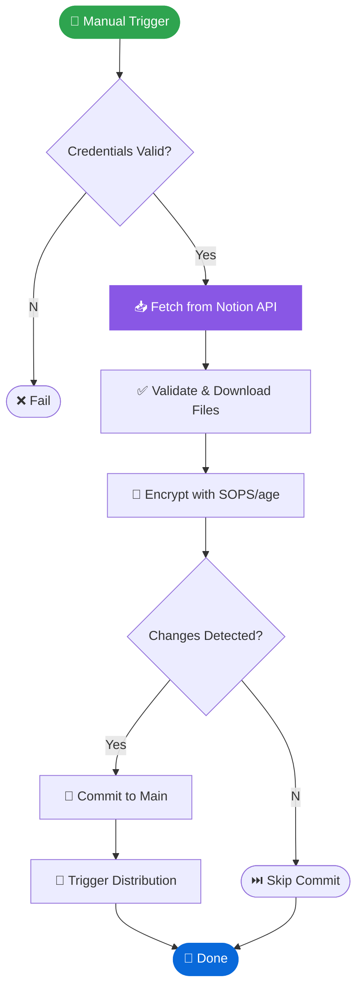

# GitHub Developer Tools Suite

!!! warning "Archived record"
    This page describes the Firebase-era platform or a migration step that has
    completed. It is kept as history and is not a current runbook. The current
    platform is described from the [home page](../index.md).


> **Context**: Part of the Hybrid Cloud Works DevOps ecosystem. Validating workflows, scanning for
> secrets, and visualizing dependencies in real-time.


---

## 🛠️ Tool: Notion to SOPS Sync

> **Description**: Automatically fetches secrets from your Notion database (Source of Truth),
> validates them, and encrypts them into the repository using SOPS/age. This ensures GitOps
> compliance without exposing plaintext credentials.

| Attribute   | Details                              |
| :---------- | :----------------------------------- |
| **Type**    | `Security` / `Automation`            |
| **Trigger** | `workflow_dispatch` (Manual Trigger) |
| **Runs On** | `ubuntu-latest`                      |
| **Timeout** | `30m`                                |

### 🚀 Interactive Launch

To manually sync your secrets from Notion to the repository:

```bash
gh workflow run secret-encrypt.yml --field commit_message="chore(secrets): Monthly rotation update"
```

### 🧩 Visual Flow



### ⚙️ Configuration Specs

#### Inputs

| Name             | Required | Default                                     | Description                           |
| :--------------- | :------- | :------------------------------------------ | :------------------------------------ |
| `commit_message` | No       | `chore(secrets): sync from Notion database` | Custom message for the commit created |

#### Secrets Required

| Secret Name            | Description                                               |
| :--------------------- | :-------------------------------------------------------- |
| `NOTION_API_TOKEN`     | Integration token for Notion API access                   |
| `NOTION_SECRETS_DB_ID` | UUID of the Notion database containing secrets            |
| `SOPS_AGE_KEY`         | Private age key for encryption (stored in GitHub Secrets) |

### 🔍 Output / Artifacts

- **Encrypted File**: `infrastructure/secrets/.secrets.enc.yaml`
- **Verification Log**: Viewable in "Verify generated secrets file" step
- **Triggered Workflow**: Validated changes trigger `secret-sync.yml`

---

## ⚠️ Troubleshooting

| Error Message                               | Probable Cause                      | Fix                                                                     |
| :------------------------------------------ | :---------------------------------- | :---------------------------------------------------------------------- |
| `Error: Process completed with exit code 1` | General failure in script execution | Check "Fetch secrets from Notion" step logs for specific JS error.      |
| `Authentication failed`                     | Invalid Notion token                | Verify `NOTION_API_TOKEN` matches the integration token in Notion.      |
| `ignored by .gitignore`                     | `.gitignore` rules too broad        | Use the fixed workflow logic (`git add -f`) or check root `.gitignore`. |
| `SOPS metadata not found`                   | Empty file or bad encryption        | Ensure `scripts/notion-to-yaml.js` generated valid YAML output.         |

---

## 🔗 Related Tools

- Secrets Distribution (Frontend) *(historical target unavailable)*
- Workflow Linter *(historical target unavailable)*
