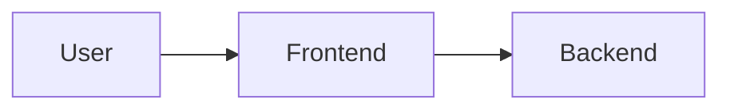

# HCW Knowledge Management & Documentation Standards (KCS v6)

!!! warning "Archived record"
    This page describes the Firebase-era platform or a migration step that has
    completed. It is kept as history and is not a current runbook. The current
    platform is described from the [home page](../index.md).


**Owner:** Persona 10 (KCS/ITIL Master) **Status:** Active Standard 🟢 **Last Updated:** February
10, 2026

---

## 1. Core Principles (KCS v6)

- **Solve Once, User Many**: Document solutions immediately after verification.
- **Single Source of Truth**: Never duplicate knowledge; link to the authoritative source.
- **Context-Complete**: Documentation must provide enough context for an agent (AI or Human) to act
  without external queries.
- **Lifecycle Managed**: Documents are created, updated, and archived systematically.

---

## 2. Naming Convention (Strict)

All files in `/documentation` must follow the 3-part format: **`[AREA]-[SPECIALTY]-[PURPOSE].md`**

| Component     | Definition          | Context     | Examples                                                                                    |
| :------------ | :------------------ | :---------- | :------------------------------------------------------------------------------------------ |
| **AREA**      | Broad Tech Domain   | The "Where" | `INFRASTRUCTURE`, `FRONTEND`, `SECURITY`, `PROCESS`, `ARCHITECTURE`, `PLANNING`, `DATABASE` |
| **SPECIALTY** | Specific Technology | The "What"  | `BACKEND`, `FIREBASE`, `SECRETS`, `GITOPS`, `REACT`, `PERSONAS`                             |
| **PURPOSE**   | Document Type       | The "Why"   | `GUIDE`, `ARCHITECTURE`, `STANDARD`, `REVIEW`, `MAPPING`, `POPULATION`                      |

### ✅ Valid Examples

- `architecture-infrastructure-complete.md`
- `security-secrets-guide.md`
- `frontend-firebase-architecture.md`
- `process-documentation-standards.md`

### ❌ Invalid Examples

- `deployment.md` (Too vague)
- `backend-plan.md` (Plans are transient, not knowledge)
- `new-architecture-final.md` (No versioning in filename)

---

## 3. Formatting Standards

### 3.1 Structure

Every document must start with:

```markdown
# Title of Document

**Version:** 1.x **Maintainer:** [Persona Name] **Status:** [Draft/Active/Deprecated]

---

## Executive Summary

(2-3 sentences explaining what this document covers)
```

### 3.2 Visuals (Mermaid.js)

Prefer **Code-Based Diagrams** (Mermaid) over static images for maintainability.



### 3.3 Code Blocks

Always use fenced code blocks with language identifiers:

```bash
# Good
npm run build
```

---

## 4. Lifecycle & Archiving

- **Active Docs**: Live in `/documentation/`. Must be accurate to the current `main` branch.
- **Archived Docs**: Moved to `/documentation/archive/`.
  - _Triggers for Archiving_: Feature deprecated, Version superseded (Old vs New), One-time reports
    (e.g., "Feb 10 Status").

---

## 5. Golden Knowledge Base (The "Must Read")

| Domain           | Authoritative Document                                                                 |
| :--------------- | :------------------------------------------------------------------------------------- |
| **Architecture** | [`architecture-system-overview.md`](../archive/architecture-system-overview.md)                 |
| **Frontend**     | [`frontend-firebase-architecture.md`](../archive/frontend-firebase-architecture.md)             |
| **Backend**      | [`architecture-infrastructure-complete.md`](../archive/architecture-infrastructure-complete.md) |
| **Security**     | [`security-secrets-guide.md`](../archive/security-secrets-guide.md)                             |
| **Pipelines**    | [`pipeline-deployment-guide.md`](../archive/pipeline-deployment-guide.md)                       |
| **Standards**    | [`process-documentation-standards.md`](../archive/process-documentation-standards.md)           |
| **Git Commits**  | [`process-commit-standards.md`](../archive/process-commit-standards.md)                         |

---

**Maintained By:** KCS Expert (Persona 10)
