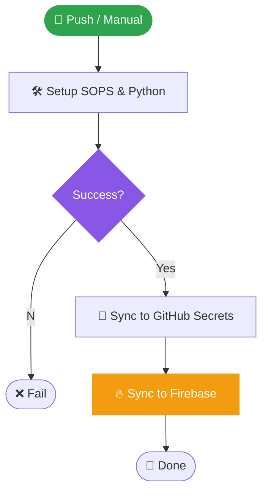

# HCW Secrets Management - Complete Guide

!!! warning "Archived record"
    This page describes the Firebase-era platform or a migration step that has
    completed. It is kept as history and is not a current runbook. The current
    platform is described from the [home page](../index.md).


**Date**: February 10, 2026, 3:41 AM CST **Status**: Production Architecture - Frontend with
Firebase **Reference**: agents.md (Passkey System Architecture)

---

## 🎯 **What is This System?**

Your secrets management system is a **3-tier architecture** that keeps sensitive data (API keys,
passwords, tokens) secure while making them accessible to your applications.

### **The Three Tiers**

```
┌─────────────────────────────────────────────────────────────┐
│ TIER 1: NOTION (Single Source of Truth)                    │
│ • Human-readable database                                   │
│ • Easy to update via web UI                                 │
│ • Tracks rotation dates, ownership, metadata               │
└────────────────────┬────────────────────────────────────────┘
                     │
                     │ (1) secret-encrypt.yml workflow
                     │     Fetches via Notion API
                     ↓
┌─────────────────────────────────────────────────────────────┐
│ TIER 2: SOPS (Encrypted Storage in Git)                    │
│ • File: infrastructure/secrets/.secrets.enc.yaml            │
│ • Encrypted with age (public key cryptography)             │
│ • Safe to commit to Git (encrypted at rest)                │
│ • Decrypted only by authorized systems                     │
└────────────────────┬────────────────────────────────────────┘
                     │
                     │ (2) secrets-sync.yml workflow
                     │     Decrypts and distributes
                     ↓
┌─────────────────────────────────────────────────────────────┐
│ TIER 3: DISTRIBUTION TARGETS                                │
│ • GitHub Secrets (for CI/CD workflows)                      │
│ • Firebase Secret Manager (for Cloud Functions)            │
│ • VPS .env file (for backend services) [Future]            │
│ • Kubernetes secrets (for K8s deployments) [Future]        │
└─────────────────────────────────────────────────────────────┘
```

---

## 🔐 **Why This Architecture?**

### **Problem**: Traditional secrets management is fragmented

- Secrets scattered across GitHub, Firebase, VPS, K8s
- No single source of truth
- Manual rotation is error-prone
- Hard to audit who has access

### **Solution**: Centralized, automated, auditable

- ✅ **Notion** = Single source of truth (easy to update)
- ✅ **SOPS** = Encrypted backup in Git (version controlled)
- ✅ **Automated distribution** = No manual copying
- ✅ **Automated rotation** = Monthly rotation of eligible secrets
- ✅ **Audit trail** = Notion tracks who changed what, when

---

## 📋 **STEP 1: Set Up Notion Database**

### **1.1 Create Notion Integration**

1. **Go to Notion Integrations**:

   ```
   https://www.notion.so/my-integrations
   ```

2. **Click "New integration"**:
   - Name: `HCW Secrets Manager`
   - Associated workspace: Your workspace
   - Type: Internal integration
   - Capabilities: Read content, Update content, Insert content

3. **Copy the Integration Token**:
   - Format: `secret_xxxxxxxxxxxxxxxxxxxxxxxxxxxxx`
   - Save this as `NOTION_API_TOKEN` (you'll need it later)

---

### **1.2 Create Secrets Database**

1. **Create a new Notion page** called "HCW Secrets"

2. **Create a database** with these properties:

| Property          | Type         | Description                                                  |
| ----------------- | ------------ | ------------------------------------------------------------ |
| **Name**          | Title        | Secret name (e.g., `FIREBASE_API_KEY`)                       |
| **Value**         | Text         | The actual secret value                                      |
| **Category**      | Select       | `Frontend`, `Backend`, `Infrastructure`, `AI`, `Integration` |
| **Environment**   | Multi-select | `Production`, `Staging`, `Development`                       |
| **CanAutoRotate** | Checkbox     | Can this be auto-rotated?                                    |
| **NextRotation**  | Date         | When to rotate next                                          |
| **Owner**         | Person       | Who owns this secret                                         |
| **Description**   | Text         | What this secret is for                                      |
| **LastRotated**   | Date         | When was it last rotated                                     |
| **CreatedAt**     | Created time | Auto-populated                                               |

3. **Share database with integration**:
   - Click "..." menu in top right
   - Click "Add connections"
   - Select "HCW Secrets Manager"

4. **Copy the Database ID**:
   - From URL: `https://notion.so/xxxxxxxxxxxxx?v=yyy`
   - The `xxxxxxxxxxxxx` part is your `NOTION_SECRETS_DB_ID`
   - Format: 32 characters (no dashes)

---

### **1.3 Populate Initial Secrets**

Add these secrets to your Notion database:

#### **Frontend Secrets** (Production)

| Name                                | Category | Environment | CanAutoRotate | Description                       |
| ----------------------------------- | -------- | ----------- | ------------- | --------------------------------- |
| `VITE_FIREBASE_API_KEY`             | Frontend | Production  | ❌            | Firebase web API key              |
| `VITE_FIREBASE_AUTH_DOMAIN`         | Frontend | Production  | ❌            | Firebase auth domain              |
| `VITE_FIREBASE_PROJECT_ID`          | Frontend | Production  | ❌            | Firebase project ID               |
| `VITE_FIREBASE_STORAGE_BUCKET`      | Frontend | Production  | ❌            | Firebase storage bucket           |
| `VITE_FIREBASE_MESSAGING_SENDER_ID` | Frontend | Production  | ❌            | Firebase messaging sender ID      |
| `VITE_FIREBASE_APP_ID`              | Frontend | Production  | ❌            | Firebase app ID                   |
| `VITE_FIREBASE_MEASUREMENT_ID`      | Frontend | Production  | ❌            | Firebase analytics measurement ID |

#### **Infrastructure Secrets** (Production)

| Name                  | Category       | Environment | CanAutoRotate | Description                                   |
| --------------------- | -------------- | ----------- | ------------- | --------------------------------------------- |
| `GCP_SA_KEY`          | Infrastructure | Production  | ❌            | GCP service account JSON (entire JSON object) |
| `FIREBASE_PROJECT_ID` | Infrastructure | Production  | ❌            | Firebase project ID                           |
| `NOTION_API_TOKEN`    | Integration    | Production  | ❌            | Notion API integration token                  |
| `SOPS_AGE_PUBLIC_KEY` | Infrastructure | Production  | ❌            | age public key for SOPS encryption            |

#### **AI API Secrets** (Future)

| Name                 | Category | Environment | CanAutoRotate | Description              |
| -------------------- | -------- | ----------- | ------------- | ------------------------ |
| `OPENAI_API_KEY`     | AI       | Production  | ❌            | OpenAI API key           |
| `CLAUDE_API_KEY`     | AI       | Production  | ❌            | Anthropic Claude API key |
| `GEMINI_API_KEY`     | AI       | Production  | ❌            | Google Gemini API key    |
| `PERPLEXITY_API_KEY` | AI       | Production  | ❌            | Perplexity API key       |

**Note**: Set `CanAutoRotate = ❌` for external API keys (must be rotated manually in provider
console)

---

## 🔑 **STEP 2: Set Up SOPS Encryption**

### **2.1 Install age (Encryption Tool)**

**On Windows** (using Chocolatey):

```powershell
choco install age
```

**Or download manually**:

```
https://github.com/FiloSottile/age/releases
```

**Verify installation**:

```bash
age --version
# Should output: v1.x.x
```

---

### **2.2 Generate age Key Pair**

```bash
# Generate new key pair
age-keygen -o ~/.config/sops/age/keys.txt

# Output will show:
# Public key: age1xxxxxxxxxxxxxxxxxxxxxxxxxxxxxxxxxxxxxxxxxxxxxxxxxx
# (Save this as SOPS_AGE_PUBLIC_KEY in Notion)
```

**IMPORTANT**:

- The **private key** is in `~/.config/sops/age/keys.txt` (keep secret!)
- The **public key** starts with `age1...` (safe to share, used for encryption)

---

### **2.3 Create SOPS Configuration**

Create `.sops.yaml` in repository root:

```yaml
# .sops.yaml
# SOPS configuration for HCW secrets management

creation_rules:
  # Rule for infrastructure secrets
  - path_regex: infrastructure/secrets/\.secrets\.enc\.yaml$
    age: age1xxxxxxxxxxxxxxxxxxxxxxxxxxxxxxxxxxxxxxxxxxxxxxxxxx
    # ↑ Replace with your public key from step 2.2

  # Rule for environment-specific secrets (future)
  - path_regex: infrastructure/secrets/\.secrets\.(prod|staging|dev)\.enc\.yaml$
    age: age1xxxxxxxxxxxxxxxxxxxxxxxxxxxxxxxxxxxxxxxxxxxxxxxxxx
```

**Replace** `age1xxx...` with your actual public key!

---

### **2.4 Create Secrets Directory**

```bash
# Create directory structure
mkdir -p infrastructure/secrets

# Create .gitignore to prevent committing plaintext secrets
cat > infrastructure/secrets/.gitignore << 'EOF'
# Never commit plaintext secrets
*.yaml
!.secrets.enc.yaml

# Only commit encrypted files
.secrets.enc.yaml
EOF
```

---

## 🤖 **STEP 3: Set Up GitHub Secrets**

### **3.1 Add Secrets to GitHub Repository**

Go to: `https://github.com/saulpatinojr/Personal-Site_HCW/settings/secrets/actions`

Add these **3 critical secrets**:

#### **Secret 1: NOTION_API_TOKEN**

- **Name**: `NOTION_API_TOKEN`
- **Value**: `secret_xxxxxxxxxxxxxxxxxxxxxxxxxxxxx` (from Step 1.1)

#### **Secret 2: NOTION_SECRETS_DB_ID**

- **Name**: `NOTION_SECRETS_DB_ID`
- **Value**: `xxxxxxxxxxxxx` (32 characters, from Step 1.2)

#### **Secret 3: SOPS_AGE_KEY**

- **Name**: `SOPS_AGE_KEY`
- **Value**: Paste the **entire contents** of `~/.config/sops/age/keys.txt`
  ```
  # created: 2026-02-10T09:22:39Z
  # public key: age1xxxxxxxxxxxxxxxxxxxxxxxxxxxxxxxxxxxxxxxxxxxxxxxxxx
  AGE-SECRET-KEY-1XXXXXXXXXXXXXXXXXXXXXXXXXXXXXXXXXXXXXXXXXXXXXXXXXXXXX
  ```

**Why these 3?**

- `NOTION_API_TOKEN` - Allows workflows to read from Notion
- `NOTION_SECRETS_DB_ID` - Tells workflows which database to read
- `SOPS_AGE_KEY` - Allows workflows to decrypt `.secrets.enc.yaml`

---

## 🔄 **STEP 4: Test the Workflow**

### **4.1 Trigger notion-to-sops Workflow**

1. **Go to GitHub Actions**:

   ```
   https://github.com/saulpatinojr/Personal-Site_HCW/actions/workflows/secret-encrypt.yml
   ```

2. **Click "Run workflow"**:
   - Branch: `main`
   - Custom commit message: `chore(secrets): initial SOPS setup`
   - Click "Run workflow"

3. **Watch the workflow run**:
   - Should complete in ~1-2 minutes
   - Check for green checkmarks ✅

4. **Verify output**:

   ```bash
   # Pull latest changes
   git pull

   # Check encrypted file was created
   ls -la infrastructure/secrets/.secrets.enc.yaml
   # Should exist and be ~2-5 KB

   # View encrypted content (safe to view)
   cat infrastructure/secrets/.secrets.enc.yaml
   # Should see SOPS metadata and encrypted values
   ```

---

### **4.2 Test Decryption Locally**

```bash
# Install SOPS
# Windows (Chocolatey):
choco install sops

# Or download from: https://github.com/getsops/sops/releases

# Decrypt secrets (requires private key in ~/.config/sops/age/keys.txt)
sops -d infrastructure/secrets/.secrets.enc.yaml

# Should output plaintext YAML with all secrets
# Example:
# VITE_FIREBASE_API_KEY: AIzaSy...
# VITE_FIREBASE_AUTH_DOMAIN: hybridcloudworks-61e8d.firebaseapp.com
# ...
```

**If decryption works**, your setup is correct! 🎉

---

## 🔁 **STEP 5: Understanding Rotation**

### **5.1 Automatic Rotation**

The `secrets-rotate-and-sync-notion.yml` workflow runs **monthly** (1st of each month at 00:00 UTC).

**What it rotates**:

- Secrets with `CanAutoRotate = ✅`
- Secrets with `NextRotation <= today`

**What it does**:

1. Queries Notion for eligible secrets
2. Generates new random values (64 characters, cryptographically secure)
3. Updates Notion database with:
   - New `Value`
   - New `NextRotation` (30 days from now)
   - Updated `LastRotated` (today)
4. Triggers `secret-encrypt.yml` to regenerate `.secrets.enc.yaml`
5. Triggers `secrets-sync.yml` to distribute to targets

**Example auto-rotatable secrets**:

- `DB_PASSWORD` (database passwords)
- `PYTHON_SECRET_KEY` (application secrets)
- `N8N_ENCRYPTION_KEY` (workflow encryption)

---

### **5.2 Manual Rotation**

For external API keys (OpenAI, Firebase, etc.), you must rotate manually:

1. **Rotate in provider console**:
   - Firebase: Generate new API key in Firebase Console
   - OpenAI: Rotate key in OpenAI dashboard
   - etc.

2. **Update Notion database**:
   - Edit the secret's `Value` field
   - Update `LastRotated` to today
   - Update `NextRotation` to 90 days from now

3. **Trigger sync**:
   - Go to GitHub Actions
   - Run `secret-encrypt.yml` workflow
   - This will update `.secrets.enc.yaml` and distribute

---

### **5.3 Trigger Manual Rotation Workflow**

To force rotation of all eligible secrets:

1. **Go to GitHub Actions**:

   ```
   https://github.com/saulpatinojr/Personal-Site_HCW/actions/workflows/secrets-rotate-and-sync-notion.yml
   ```

2. **Click "Run workflow"**:
   - `force_rotation`: ✅ (ignore dates, rotate all eligible)
   - `include_manual`: ❌ (skip manual-only secrets)
   - Click "Run workflow"

3. **Review output**:
   - Check which secrets were rotated
   - Verify new values in Notion

---

## 📊 **STEP 6: Distribution to Targets**

### **6.1 GitHub Secrets (For CI/CD)**

The `secrets-sync.yml` workflow will:

1. Decrypt `.secrets.enc.yaml`
2. Filter secrets for GitHub (e.g., `VITE_*`, `GCP_SA_KEY`)
3. Use GitHub API to update repository secrets
4. Verify sync completed

**Secrets synced to GitHub**:

- All `VITE_*` variables (for frontend build)
- `GCP_SA_KEY` (for Firebase deployment)
- `FIREBASE_PROJECT_ID` (for Firebase deployment)

---

### **6.2 Firebase Secret Manager (For Cloud Functions)**

The `secrets-sync.yml` workflow will:

1. Decrypt `.secrets.enc.yaml`
2. Filter secrets for Firebase (AI APIs, integrations)
3. Use `gcloud` CLI to update Secret Manager
4. Verify sync completed

**Secrets synced to Firebase**:

- `OPENAI_API_KEY`
- `CLAUDE_API_KEY`
- `GEMINI_API_KEY`
- `PERPLEXITY_API_KEY`
- `WIKIJS_API_KEY`
- `RESEND_API_KEY`
- `NOTION_API_KEY`

---

## 🔧 **STEP 7: GitHub Workflows Configuration**

### **7.1 Workflow Inventory**

Your repository has **8 GitHub workflows**. Here's their status for the frontend architecture:

| Workflow                             | Status     | Purpose                    | Action                  |
| ------------------------------------ | ---------- | -------------------------- | ----------------------- |
| `frontend-deploy.yml`                | ✅ KEEP    | Deploy to Firebase Hosting | No changes              |
| `code-quality.yml`                   | ✅ KEEP    | ESLint, Prettier, tests    | Minor cleanup           |
| `security-scan.yml`                  | ✅ KEEP    | Dependency scanning        | No changes              |
| `lighthouse-audit.yml`               | ✅ KEEP    | Performance audits         | No changes              |
| `secret-encrypt.yml`                 | ✅ KEEP    | Notion → SOPS sync         | No changes              |
| `secrets-rotate-and-sync-notion.yml` | ✅ KEEP    | Monthly rotation           | No changes              |
| `secrets-sync.yml`                   | 🔄 UPDATE  | Distribution               | Create frontend version |
| `ci-helm-lint.yml`                   | ❌ ARCHIVE | Kubernetes linting         | Move to legacy          |

---

### **7.2 Workflow Cleanup Actions**

#### **Action 1: Archive Kubernetes Workflow**

```bash
# Create legacy folder
mkdir -p .github/workflows/legacy

# Move Helm lint workflow (backend only)
git mv .github/workflows/ci-helm-lint.yml .github/workflows/legacy/
```

**Why**: This workflow is for Kubernetes deployments (backend). Frontend uses Firebase Hosting.

---

#### **Action 2: Create Frontend Secrets Sync**

Create `.github/workflows/secret-sync.yml`:

```yaml
name: Sync Secrets (Frontend)

on:
  workflow_dispatch:
  push:
    branches: [main]
    paths:
      - 'infrastructure/secrets/.secrets.enc.yaml'

jobs:
  sync-firebase:
    name: Sync to Firebase Secret Manager
    runs-on: ubuntu-latest
    steps:
      - name: Checkout
        uses: actions/checkout@v4

      - name: Install SOPS and age
        run: |
          sudo apt-get update -qq
          sudo apt-get install -y -qq age
          SOPS_VERSION=3.11.0
          sudo curl -fsSL \
            https://github.com/getsops/sops/releases/download/v${SOPS_VERSION}/sops-v${SOPS_VERSION}.linux.amd64 \
            -o /usr/local/bin/sops
          sudo chmod +x /usr/local/bin/sops

      - name: Setup SOPS age key
        run: |
          mkdir -p ~/.config/sops/age
          printf '%s\n' "${{ secrets.SOPS_AGE_KEY }}" > ~/.config/sops/age/keys.txt
          chmod 600 ~/.config/sops/age/keys.txt

      - name: Decrypt secrets
        run: |
          sops -d infrastructure/secrets/.secrets.enc.yaml > /tmp/secrets.yaml

      - name: Filter secrets for Firebase
        run: |
          # Install yq
          YQ_VERSION=4.40.5
          sudo curl -fsSL \
            https://github.com/mikefarah/yq/releases/download/v${YQ_VERSION}/yq_linux_amd64 \
            -o /usr/local/bin/yq
          sudo chmod +x /usr/local/bin/yq

          # Firebase gets: AI APIs + integrations
          yq eval 'to_entries | map(select((.key | test("^OPENAI_")) or (.key | test("^CLAUDE_")) or (.key | test("^GEMINI_")) or (.key | test("^PERPLEXITY_")) or (.key | test("^WIKIJS_")) or (.key | test("^RESEND_")) or (.key | test("^NOTION_API_KEY$")))) | .[] | .key + "=" + (.value | @json)' /tmp/secrets.yaml > /tmp/firebase.env

      - name: Install Firebase CLI
        run: npm install -g firebase-tools@latest

      - name: Sync to Firebase Secret Manager
        env:
          GCP_PROJECT_ID: hybridcloudworks-61e8d
        run: |
          # Extract GCP service account key
          yq eval '.GCP_SA_KEY' /tmp/secrets.yaml > /tmp/gcp-sa-key.json

          # Authenticate with GCP
          gcloud auth activate-service-account --key-file=/tmp/gcp-sa-key.json
          gcloud config set project $GCP_PROJECT_ID

          # Sync secrets to Secret Manager
          while IFS='=' read -r key value; do
            echo "Syncing $key to Secret Manager..."
            # Create secret if doesn't exist
            gcloud secrets describe "$key" || gcloud secrets create "$key"
            # Add new version
            echo -n "$value" | gcloud secrets versions add "$key" --data-file=-
          done < /tmp/firebase.env

      - name: Summary
        run: |
          echo "## 🔐 Secrets Sync Complete" >> $GITHUB_STEP_SUMMARY
          echo "" >> $GITHUB_STEP_SUMMARY
          echo "- **Target**: Firebase Secret Manager" >> $GITHUB_STEP_SUMMARY
          echo "- **Project**: hybridcloudworks-61e8d" >> $GITHUB_STEP_SUMMARY
          echo "- **Secrets**: AI APIs + Integrations" >> $GITHUB_STEP_SUMMARY
```

---

#### **Action 3: Archive Original Secrets Sync**

```bash
# Move original to legacy (contains VPS/K8s logic)
git mv .github/workflows/secrets-sync.yml .github/workflows/legacy/secrets-sync-backend.yml
```

**Why**: Original workflow syncs to VPS and Kubernetes (backend infrastructure). Frontend version
only syncs to Firebase Secret Manager.

---

#### **Action 4: Optional Cleanup**

Clean up `code-quality.yml` to remove non-existent paths:

```yaml
# In .github/workflows/code-quality.yml
# Remove these lines from paths:
- 'functions/src/**' # Line 12, 22
- 'tsconfig.json' # Line 15, 25
```

**Why**: These paths don't exist in frontend-only architecture. Removal is optional (non-blocking).

---

### **7.3 Required GitHub Secrets**

#### **For Frontend** (9 secrets)

```
VITE_FIREBASE_API_KEY
VITE_FIREBASE_AUTH_DOMAIN
VITE_FIREBASE_PROJECT_ID
VITE_FIREBASE_STORAGE_BUCKET
VITE_FIREBASE_MESSAGING_SENDER_ID
VITE_FIREBASE_APP_ID
VITE_FIREBASE_MEASUREMENT_ID
GCP_SA_KEY
FIREBASE_PROJECT_ID
```

#### **For Secrets Management** (3 secrets)

```
NOTION_API_TOKEN
NOTION_SECRETS_DB_ID
SOPS_AGE_KEY
```

**Total**: 12 GitHub Secrets

---

## 🎯 **STEP 8: Adding New Secrets**

### **8.1 Add to Notion Database**

1. Open Notion database
2. Click "New" to add row
3. Fill in all fields:
   - **Name**: `NEW_SECRET_NAME` (uppercase, underscores)
   - **Value**: The actual secret value
   - **Category**: Select appropriate category
   - **Environment**: Select environment(s)
   - **CanAutoRotate**: ✅ if internal, ❌ if external API
   - **NextRotation**: 30 days from now (if auto-rotatable)
   - **Owner**: Your name
   - **Description**: What this secret is for

4. Save the row

---

### **8.2 Sync to SOPS**

1. **Trigger workflow**:
   - Go to GitHub Actions
   - Run `secret-encrypt.yml`
   - Wait for completion

2. **Verify**:
   ```bash
   git pull
   sops -d infrastructure/secrets/.secrets.enc.yaml | grep NEW_SECRET_NAME
   # Should show your new secret
   ```

---

### **8.3 Distribute to Targets**

1. **Trigger distribution**:
   - Go to GitHub Actions
   - Run `secret-sync.yml`
   - Wait for completion

2. **Verify in GitHub Secrets**:
   - Go to repository settings → Secrets
   - Check if `NEW_SECRET_NAME` appears (if it matches filter)

---

## 🔒 **Security Best Practices**

### **DO**:

- ✅ Always use Notion as source of truth
- ✅ Keep `SOPS_AGE_KEY` private (never commit!)
- ✅ Rotate secrets regularly (30-90 days)
- ✅ Use strong, random values (64+ characters)
- ✅ Document what each secret is for
- ✅ Review access logs in Notion

### **DON'T**:

- ❌ Never commit plaintext secrets to Git
- ❌ Never share `SOPS_AGE_KEY` via Slack/email
- ❌ Never hardcode secrets in code
- ❌ Never use weak passwords (e.g., `password123`)
- ❌ Never skip rotation for auto-rotatable secrets

---

## 🆘 **Troubleshooting**

### **Issue: "SOPS decryption failed"**

**Cause**: Missing or incorrect age private key

**Solution**:

```bash
# Check if key file exists
ls ~/.config/sops/age/keys.txt

# If missing, restore from backup or regenerate
age-keygen -o ~/.config/sops/age/keys.txt

# Update SOPS_AGE_PUBLIC_KEY in Notion and .sops.yaml
```

---

### **Issue: "Notion API authentication failed"**

**Cause**: Invalid `NOTION_API_TOKEN` or database not shared

**Solution**:

1. Verify token in GitHub Secrets
2. Check database is shared with integration:
   - Open Notion database
   - Click "..." → "Add connections"
   - Select "HCW Secrets Manager"

---

### **Issue: "Secret not syncing to GitHub"**

**Cause**: Secret not in filter or workflow not run

**Solution**:

1. Check secret name matches filter pattern (e.g., `VITE_*`)
2. Manually trigger `secrets-sync-frontend.yml`
3. Check workflow logs for errors

---

## 📚 **Quick Reference**

### **Workflows**

| Workflow                             | Trigger        | Purpose                |
| ------------------------------------ | -------------- | ---------------------- |
| `notion-to-sops.yml`                 | Manual         | Sync Notion → SOPS     |
| `secrets-rotate-and-sync-notion.yml` | Monthly (1st)  | Auto-rotate secrets    |
| `secret-sync.yml`                    | On SOPS change | Distribute to Firebase |

### **Commands**

```bash
# Decrypt secrets locally
sops -d infrastructure/secrets/.secrets.enc.yaml

# Encrypt new secrets file
sops -e secrets.yaml > .secrets.enc.yaml

# View encrypted file (safe)
cat infrastructure/secrets/.secrets.enc.yaml

# Generate new age key
age-keygen -o ~/.config/sops/age/keys.txt
```

### **Files**

```
.sops.yaml                                  # SOPS configuration
infrastructure/secrets/.secrets.enc.yaml    # Encrypted secrets (safe to commit)
~/.config/sops/age/keys.txt                # Private key (NEVER commit!)
```

---

## ✅ **Setup Checklist**

- [ ] Created Notion integration
- [ ] Created Notion secrets database
- [ ] Populated initial secrets in Notion
- [ ] Installed age encryption tool
- [ ] Generated age key pair
- [ ] Created `.sops.yaml` configuration
- [ ] Created `infrastructure/secrets/` directory
- [ ] Added 3 GitHub Secrets (NOTION_API_TOKEN, NOTION_SECRETS_DB_ID, SOPS_AGE_KEY)
- [ ] Tested `secret-encrypt.yml` workflow
- [ ] Verified `.secrets.enc.yaml` created
- [ ] Tested local decryption with SOPS
- [ ] Archived `ci-helm-lint.yml` to legacy
- [ ] Created `secret-sync.yml` workflow
- [ ] Archived original `secrets-sync.yml` to legacy
- [ ] Tested distribution to Firebase Secret Manager

---

## 🚀 **Next Steps**

After completing this setup:

1. **Configure remaining GitHub Secrets**:
   - Add all 9 `VITE_FIREBASE_*` and infrastructure secrets

- - These can be added manually OR via `secret-sync.yml` once created

2. **Test end-to-end flow**:
   - Update secret in Notion
   - Run `secret-encrypt.yml`
   - Run `secret-sync.yml`
   - Verify secret updated in Firebase

3. **Document for team**:
   - Share this guide with team members
   - Train on how to add/rotate secrets
   - Set up access controls in Notion

---

**Ready to set this up?** Follow the steps above in order. Each step should take 10-15 minutes.

---

## Consolidated from `secrets-folder-info.md`

_Merged 2026-05-27 during documentation reorganization. Original archived at
`archive/docs/secrets-folder-info.md`._

# Secrets Folder

⚠️ **CRITICAL: This folder contains sensitive data. NEVER commit to version control.**

**Git note:** Ensure this folder is ignored by Git. Add `infrastructure/secrets/` to your repository
`.gitignore` and do not commit any files from this folder (including `.env`, `credentials/`, or
`.kube_config_raw`).

**Status**: Frontend deployments active. Backend/VPS deployments currently at Stage 0 (empty).

## Folder Structure

```
secrets/
├── .sops.yaml              # SOPS encryption configuration (public keys only)
├── env/                    # Environment variable files
│   ├── .env               # Frontend application secrets
│   ├── functions.env      # Firebase Cloud Functions secrets
│   └── scripts.env        # Deployment scripts environment
├── kubernetes/            # Kubernetes configuration (future backend)
│   └── .kube_config_raw   # Kubeconfig - NOT NEEDED YET (VPS Stage 0)
└── credentials/           # Service account and credentials
    └── serviceAccountKey.json  # Firebase service account
```

## Credentials & Passwords Inventory

**IMPORTANT**: This table documents WHAT each credential is, WHERE it's used, and which workflows
reference it.

| Credential                            | Type     | Purpose                            | Used In                | Workflow                                                                                              | Status                      |
| ------------------------------------- | -------- | ---------------------------------- | ---------------------- | ----------------------------------------------------------------------------------------------------- | --------------------------- |
| **VITE_FIREBASE_API_KEY**             | API Key  | Firebase SDK authentication        | `secrets/env/.env`     | frontend-deploy, code-quality, lighthouse-audit                                                       | ✅ Active                   |
| **VITE_FIREBASE_AUTH_DOMAIN**         | Config   | Firebase Auth domain               | `secrets/env/.env`     | frontend-deploy, code-quality                                                                         | ✅ Active                   |
| **VITE_FIREBASE_PROJECT_ID**          | Config   | Firebase project identifier        | `secrets/env/.env`     | frontend-deploy, code-quality                                                                         | ✅ Active                   |
| **VITE_FIREBASE_STORAGE_BUCKET**      | Config   | Firebase Storage bucket            | `secrets/env/.env`     | frontend-deploy                                                                                       | ✅ Active                   |
| **VITE_FIREBASE_MESSAGING_SENDER_ID** | Config   | Firebase Cloud Messaging           | `secrets/env/.env`     | frontend-deploy                                                                                       | ✅ Active                   |
| **VITE_FIREBASE_APP_ID**              | Config   | Firebase app ID                    | `secrets/env/.env`     | frontend-deploy                                                                                       | ✅ Active                   |
| **NOTION_API_TOKEN**                  | Token    | Notion database access             | `secrets/env/.env`     | (stored for future use)                                                                               | ⏳ Inactive                 |
| **GCP_SA_KEY**                        | Key      | Google Cloud Service Account       | `secrets/credentials/` | frontend-deploy                                                                                       | ✅ Active                   |
| **FIREBASE_TOKEN**                    | Token    | Firebase CLI deployment token      | GitHub Secrets         | frontend-deploy                                                                                       | ✅ Active                   |
| **SOPS_AGE_KEY**                      | Key      | Secret encryption private key      | GitHub Secrets         | secrets-sync, secrets-rotate-and-sync-notion, notion-to-sops, kubeconfig-sync, pre/post-deploy-checks | ✅ Active                   |
| **VPS_KUBE_CONFIG**                   | Config   | Kubernetes cluster access (FUTURE) | GitHub Secrets         | 3-deploy-core, 5-deploy-apps, 6-verify                                                                | ⏳ Not needed (VPS Stage 0) |
| **VPS_SSH_KEY**                       | Key      | VPS SSH authentication (FUTURE)    | GitHub Secrets         | kubeconfig-sync, secrets-sync                                                                         | ⏳ Not needed (VPS Stage 0) |
| **KEYCLOAK_ADMIN_PASSWORD**           | Password | Keycloak admin user (FUTURE)       | GitHub Secrets         | 4-deploy-auth                                                                                         | ⏳ Not needed (VPS Stage 0) |
| **DB_PASSWORD**                       | Password | Database user password (FUTURE)    | GitHub Secrets         | 4-deploy-auth                                                                                         | ⏳ Not needed (VPS Stage 0) |

---

## Active Credentials (Frontend Only)

Currently using these credentials for **active frontend deployment**:

### 1. Firebase API Keys (.env file)

- **Location**: `secrets/env/.env`
- **Used by Workflows**:
  - `frontend-deploy.yml` - Deploys React SPA to Firebase Hosting
  - `code-quality.yml` - Runs frontend code quality checks
  - `lighthouse-audit.yml` - Performance audits on PRs
- **Purpose**: Deploy React SPA to Firebase Hosting
- **Rotation**: 90 days
- **Status**: ✅ ACTIVE

### 2. GCP Service Account Key (credentials folder)

- **Location**: `secrets/credentials/serviceAccountKey.json`
- **Used by Workflows**:
  - `frontend-deploy.yml` - Google Cloud operations
- **Purpose**: Authenticate Google Cloud operations
- **Rotation**: 180 days
- **Status**: ✅ ACTIVE

### 3. Firebase CLI Token (GitHub Secrets)

- **Location**: GitHub Secrets: `FIREBASE_TOKEN`
- **Used by Workflows**:
  - `frontend-deploy.yml` - Firebase Hosting deployments
- **Purpose**: Firebase Hosting deployments
- **Rotation**: 90 days
- **Status**: ✅ ACTIVE

### 4. SOPS Age Key (GitHub Secrets)

- **Location**: GitHub Secrets: `SOPS_AGE_KEY`
- **Used by Workflows**:
  - `secrets-sync.yml` - Distribute secrets across systems
  - `secrets-rotate-and-sync-notion.yml` - Monthly rotation from Notion
  - `secret-encrypt.yml` - Manual Notion to SOPS sync
- **Purpose**: Encrypt/decrypt secret files with SOPS
- **Rotation**: Annual or on compromise
- **Status**: ✅ ACTIVE

---

## Active Workflows (Frontend Focus)

**Current active workflows** (8 total):

### Frontend Deployment (3)

1. **frontend-deploy.yml** - Build & deploy React to Firebase Hosting
2. **code-quality.yml** - ESLint, Prettier, TypeScript, npm audit
3. **lighthouse-audit.yml** - Performance metrics on pull requests

### Secrets Management (3)

4. **secrets-sync.yml** - Sync encrypted secrets from GitHub
5. **secrets-rotate-and-sync-notion.yml** - Monthly rotation cycle
6. **secret-encrypt.yml** - Manual secret export from Notion

### General CI (2)

7. **ci-helm-lint.yml** - Validates Helm charts (for future backend)
8. **security-scan.yml** - Security scanning of dependencies & code

---

## Archived Credentials (VPS/Kubernetes - Stage 0)

**NOT NEEDED YET** - VPS is currently Stage 0 (empty). These credentials are documented for future
use:

1. **VPS_KUBE_CONFIG** - Kubernetes cluster access
2. **VPS_SSH_KEY** - VPS SSH authentication
3. **KEYCLOAK_ADMIN_PASSWORD** - Auth service admin password
4. **DB_PASSWORD** - Database user password

**When to populate:** When backend deployment begins (Phase 2) **Archive location**:
`legacy/.github/workflows/` contains all 9 backend infrastructure workflows

---

## Workflow to Credential Mapping

| Workflow                               | Credentials Used                             | Purpose              |
| -------------------------------------- | -------------------------------------------- | -------------------- |
| **frontend-deploy.yml**                | VITE*FIREBASE*\*, GCP_SA_KEY, FIREBASE_TOKEN | Deploy React SPA     |
| **code-quality.yml**                   | VITE*FIREBASE*\*                             | Frontend CI checks   |
| **lighthouse-audit.yml**               | VITE*FIREBASE*\*                             | Performance auditing |
| **secrets-sync.yml**                   | SOPS_AGE_KEY                                 | Secret distribution  |
| **secrets-rotate-and-sync-notion.yml** | SOPS_AGE_KEY, NOTION_API_TOKEN               | Monthly rotation     |
| **secret-encrypt.yml**                 | SOPS_AGE_KEY, NOTION_API_TOKEN               | Manual secret export |

**Complete workflow details**: See workflow-review.md *(historical target unavailable)*

## File Descriptions

### `.sops.yaml`

- **Purpose**: SOPS (Secrets OPerationS) encryption configuration
- **Contains**: Public encryption keys, encryption rules
- **Status**: Safe to reference (contains only PUBLIC keys)
- **Do NOT**: Commit private keys here (store in GitHub Secrets)
- **Usage**: Defines how secrets are encrypted when stored

### `env/.env`

- **Purpose**: Local application environment variables
- **Contains**: Firebase API keys, Notion tokens, database credentials
- **Status**: ⚠️ SENSITIVE - Never commit
- **Usage**: Load with `source .env` (bash) or in IDE configs
- **Gitignore**: Explicitly ignored by `.gitignore`

### `env/functions.env`

- **Purpose**: Firebase Cloud Functions environment
- **Contains**: Function-specific secrets and configuration
- **Status**: ⚠️ SENSITIVE - Never commit
- **Usage**: Loaded by Functions when running locally
- **Location**: Originally at `functions/.env`

### `env/scripts.env`

- **Purpose**: Scripts and utilities environment configuration
- **Contains**: API keys, deployment credentials
- **Status**: ⚠️ SENSITIVE - Never commit
- **Usage**: Sourced by shell scripts that need credentials
- **Location**: Originally at `scripts/.env`

### `kubernetes/.kube_config_raw`

- **Purpose**: Kubernetes cluster access configuration
- **Contains**: Cluster CA certificates, API endpoints, user tokens
- **Status**: ⚠️ SENSITIVE - Never commit
- **Usage**: Provides kubectl access to Kubernetes cluster
- **Location**: Originally at `.kube_config_raw` (root)
- **Permissions**: Keep as read-only (chmod 600)

### `credentials/serviceAccountKey.json`

- **Purpose**: Firebase service account authentication
- **Contains**: Project ID, private key, client email, token URI
- **Status**: ⚠️ SENSITIVE - Never commit
- **Usage**: Authenticates backend services with Firebase
- **Location**: Originally at `config/serviceAccountKey.json`
- **Permissions**: Keep as read-only (chmod 600)

## .gitignore Configuration

The `/secrets/` folder is completely ignored by Git:

```gitignore
# Secrets folder - DO NOT COMMIT
secrets/
```

This means:

- ✅ All files in `/secrets/` are ignored
- ✅ Cannot accidentally commit secrets
- ❌ Changes to secret files won't be tracked
- ❌ New secret files need manual attention

## Setup Instructions

### First Time Setup

1. **Copy template files** from examples (if they exist):

   ```bash
   cp .env.example secrets/env/.env
   cp functions/.env.example secrets/env/functions.env
   ```

2. **Add real secrets** to the copied files:
   - Edit `secrets/env/.env` with actual API keys, tokens
   - Edit `secrets/env/functions.env` with function secrets
   - Edit `secrets/env/scripts.env` with script credentials

3. **Add kubeconfig** (if deploying to Kubernetes):

   ```bash
   # Get kubeconfig from cluster
   kubectl config view --raw > secrets/kubernetes/.kube_config_raw
   chmod 600 secrets/kubernetes/.kube_config_raw
   ```

4. **Add Firebase credentials** (if using Firebase):

   ```bash
   # Download from Firebase Console: Project Settings → Service Accounts
   # Place at: secrets/credentials/serviceAccountKey.json
   chmod 600 secrets/credentials/serviceAccountKey.json
   ```

5. **SOPS configuration**:
   - `.sops.yaml` is already configured
   - Store private key (`AGE-SECRET-KEY-...`) in GitHub Secrets as `SOPS_AGE_KEY`
   - Do NOT commit private key to Git

### Local Development

**Source environment variables:**

```bash
# In bash/zsh
source secrets/env/.env

# In fish
set -gx (cat secrets/env/.env | sed 's/=/ /g')

# In PowerShell
Get-Content secrets/env/.env | ForEach-Object {
  if ($_ -match '^\s*([^=]+)=(.+)$') {
    [System.Environment]::SetEnvironmentVariable($matches[1], $matches[2])
  }
}
```

**Verify secrets are loaded:**

```bash
echo $VITE_FIREBASE_API_KEY  # Should show your key
```

### Deployment

**Via GitHub Actions:**

- GitHub Secrets are used for deployment
- `.sops.yaml` provides encryption rules
- SOPS_AGE_KEY secret decrypts files during deployment

**Via Local CLI:**

```bash
# Install SOPS and age
brew install sops age

# Decrypt secrets for deployment
sops -d infrastructure/secrets/.secrets.enc.yaml
```

## Security Best Practices

### DO ✅

- Keep all files in this folder untracked
- Use strong, unique passwords/keys
- Rotate credentials regularly
- Store private keys in GitHub Secrets only
- Use `.gitignore` to prevent accidents
- Set file permissions to `600` (read-only for owner)
- Keep backups of kubeconfig and service accounts
- Review `.sops.yaml` encryption rules

### DON'T ❌

- Commit any files from this folder to Git
- Share kubeconfig or service account files
- Paste secrets into code or logs
- Use same secrets across environments
- Leave private keys in `.sops.yaml`
- Commit `.env` files
- Store credentials in plaintext in code
- Share screenshots containing secrets

## Troubleshooting

### "Command not found: source"

- You're in PowerShell or cmd
- Use the PowerShell source method above
- Or use: `bash` then run `source`

### ".env file not found"

- Check `secrets/env/.env` exists
- Copy from `.env.example` if missing
- Ensure path is correct

### "VITE_FIREBASE_API_KEY is empty"

- Environment not sourced
- Run `source secrets/env/.env` first
- Check `.env` file has actual values (not template)

### Kubeconfig permissions denied

- Fix with: `chmod 600 secrets/kubernetes/.kube_config_raw`
- Verify: `ls -l secrets/kubernetes/.kube_config_raw` shows `-rw-------`

### serviceAccountKey.json rejected

- Fix with: `chmod 600 secrets/credentials/serviceAccountKey.json`
- Verify file contains valid JSON (not template)

## Rotation Schedule

**Recommended rotation schedule:**

- API Keys: Every 90 days
- Service Account Keys: Every 180 days
- Kubeconfig: As needed (when cluster credentials rotate)
- Encryption Keys: On compromise or annually

## Related Documentation

- **`.sops.yaml`**: SOPS encryption configuration (Mozilla SOPS docs)
- **`repo-cleanup-policy.md`**: Repository cleanliness standards
- **`general-doc-guideline.md`**: General documentation guidelines
- **GitHub Secrets Docs**: https://docs.github.com/en/actions/security-guides/encrypted-secrets

## Support

If you have questions about:

- **SOPS Encryption**: See `.sops.yaml` comments
- **Kubernetes Config**: See `kubernetes/.kube_config_raw` usage
- **Firebase Setup**: See `credentials/serviceAccountKey.json` setup
- **Repository Standards**: See `repo-cleanup-policy.md`

---

**Status**: ✅ Active, Production Secrets **Last Updated**: 2026-02-06 **Backup Strategy**: Critical
files should be backed up securely offline

---

## Consolidated from `secrets-frontend.md`

_Merged 2026-05-27 during documentation reorganization. Original archived at
`archive/docs/secrets-frontend.md`._

---

title: 'Frontend Secrets Distribution - Developer Tool Suite' tool_type: 'Secrets Automation'
status: 'Active' maintainer: '@saulpatinojr' workflow_file: '.github/workflows/secret-sync.yml'

---

# GitHub Developer Tools Suite

> **Context**: Part of the Hybrid Cloud Works DevOps ecosystem. Validating workflows, scanning for
> secrets, and visualizing dependencies in real-time.


---

## 🛠️ Tool: Frontend Secrets Distribution

> **Description**: Decrypts SOPS-encrypted secrets and distributes them to GitHub Actions (CI/CD)
> and Firebase Secret Manager (Cloud Functions). Ensures frontend and AI integrations have the
> credentials they need.

| Attribute   | Details                                                      |
| :---------- | :----------------------------------------------------------- |
| **Type**    | `Deployment` / `Automation`                                  |
| **Trigger** | `push` (on main), `workflow_dispatch`, `repository_dispatch` |
| **Runs On** | `ubuntu-latest`                                              |
| **Timeout** | `15m`                                                        |

### 🚀 Interactive Launch

To manually trigger a distribution run:

```bash
gh workflow run secret-sync.yml
```

### 🧩 Visual Flow



### ⚙️ Configuration Specs

#### Secrets Distributed

1. **GitHub Actions**:
   - `VITE_*` (Frontend env vars)
   - `FIREBASE_*` (Deployment tokens)
   - `GCP_*` (Service Accounts)
   - `NOTION_*` (Integration Tokens)

2. **Firebase Secret Manager**:
   - `OPENAI_API_KEY`, `CLAUDE_API_KEY`, `GEMINI_API_KEY` (AI)
   - `WIKIJS_*`, `RESEND_*` (Integrations)

#### Secrets Required

| Secret Name      | Description                                   |
| :--------------- | :-------------------------------------------- |
| `SOPS_AGE_KEY`   | Private key to decrypt the repository secrets |
| `GITHUB_TOKEN`   | Auto-provided token to update repo secrets    |
| `FIREBASE_TOKEN` | Token to authenticate with Firebase CLI       |

### 🔍 Output / Artifacts

- **Logs**: Detailed sync status for each secret key (values masked)
- **Status**: Updates "Secrets Sync" check on PRs/Commits

---

## ⚠️ Troubleshooting

| Error Message                | Probable Cause                      | Fix                                                                     |
| :--------------------------- | :---------------------------------- | :---------------------------------------------------------------------- |
| `Decryption failed`          | `SOPS_AGE_KEY` missing or wrong key | Verify the age key in GitHub Secrets matches the one used to encrypt.   |
| `FIREBASE_TOKEN not found`   | Token missing in repo secrets       | Run `firebase login:ci` locally and add the token to GitHub Secrets.    |
| `Permission denied` (GitHub) | GITHUB_TOKEN scope issue            | Ensure workflow has `id-token: write` and `contents: read` permissions. |

---

## 🔗 Related Tools

- [Notion to SOPS Sync](../archive/notion-sops.md)
- Secret Scanner *(historical target unavailable)*
