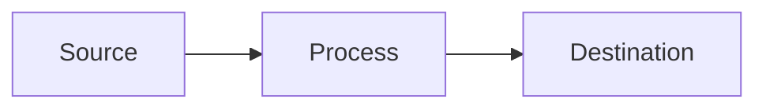

# Blog Post Template

Use this template for developer blog posts to maintain consistency.

---

````markdown
---
title: '[Your Title Here]'
date: 'YYYY-MM-DD'
author: 'Saul Patino Jr'
tags: ['tag1', 'tag2', 'tag3']
series: 'Infrastructure Automation'
excerpt: '1-2 sentence hook describing the value of this post'
---

# [Title]

> **TL;DR**: [One sentence summary of what the reader will learn]

## The Problem

[2-3 sentences describing the pain point this solves]

## The Solution

[Brief overview of the approach - 2-3 sentences]

---

## Prerequisites

Before starting, ensure you have:

- [ ] Requirement 1
- [ ] Requirement 2
- [ ] Requirement 3

```bash
# Verify tools are installed
tool --version
```

---

## Step-by-Step Guide

### Step 1: [First Action]

[Explanation of what we're doing and why]

```bash
# Command with comments
command --flag value
```

**Expected output:**

```
Example output here
```

### Step 2: [Second Action]

[Explanation]

```bash
# More commands
command --option
```

### Step 3: [Third Action]

[Explanation with any gotchas or tips]

> 💡 **Pro Tip**: [Helpful insight]

---

## The Complete Script

Here's everything together:

```bash
#!/bin/bash
# Full script with comments
# Filename: script-name.sh

# Step 1
command1

# Step 2
command2

# Step 3
command3
```

---

## How It Works



| Component   | Role                |
| ----------- | ------------------- |
| Source      | Where secrets live  |
| Process     | Transformation step |
| Destination | Where secrets go    |

---

## Security Considerations

| Principle            | Implementation     |
| -------------------- | ------------------ |
| **Least Privilege**  | [How this applies] |
| **Defense in Depth** | [How this applies] |
| **Audit Trail**      | [How this applies] |

---

## Troubleshooting

### Error: [Common Error Message]

**Cause**: [Why this happens]

**Solution**:

```bash
# Fix command
fix-command --option
```

---

## What's Next?

- [Related topic 1]
- [Related topic 2]
- [Link to next post in series]

---

## Resources

- [Official Documentation](https://...)
- [Related Gist](link-to-gist)
- [GitHub Repository](https://github.com/...)

---

_Part of the "Infrastructure Automation" series • [View all posts](/blog/series/infrastructure)_
````

---

## Blog Naming Convention

Format: `YYYY-MM-DD-descriptive-slug.md`

Example: `2024-12-22-syncing-secrets-to-github-actions.md`

## Front Matter Fields

| Field     | Required | Description                        |
| --------- | -------- | ---------------------------------- |
| `title`   | ✅       | Post title                         |
| `date`    | ✅       | Publication date                   |
| `author`  | ✅       | Author name                        |
| `tags`    | ✅       | Array of tags                      |
| `series`  | ⬜       | Series name (for multi-part posts) |
| `excerpt` | ✅       | SEO description                    |

## Writing Guidelines

1. **Start with the problem** - Hook readers with relatable pain
2. **Show, don't tell** - Use code blocks liberally
3. **Explain the "why"** - Not just the "what"
4. **Include gotchas** - Save readers from your mistakes
5. **End with next steps** - Keep them engaged

## Quality Checklist

Before publishing, ensure your post includes:

- ✅ **Generic information** - No hardcoded values, all use placeholders (YOUR_*, EXAMPLE_*)
- ✅ **Clear instructions** - Step-by-step with commands and expected output
- ✅ **Complete scripts** - Full code examples for consistency
- ✅ **Troubleshooting** - Common errors and solutions
- ✅ **Security notes** - Important security considerations throughout
- ✅ **Visual aids** - Mermaid diagrams showing data flow
- ✅ **Missing steps** - Added verification, DNS checks, config retrieval
- ✅ **Pro tips** - Helpful insights marked with 💡
- ✅ **Post-deployment** - Optional verification and next steps
