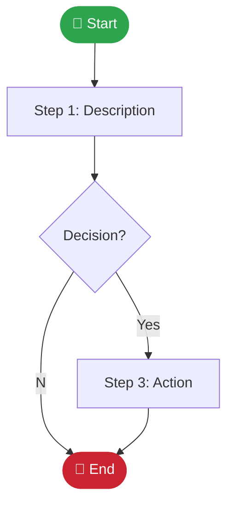

# GitHub Developer Tools Suite

> **Context**: Part of the Hybrid Cloud Works DevOps ecosystem. Validating workflows, scanning for secrets, and visualizing dependencies in real-time.

 

---

## 🛠️ Tool: [Workflow Name]

> **Description**: [Short, punchy description of what this workflow does. Example: "Validates YAML syntax & best practices." or "Syncs Notion secrets to SOPS encrypted storage."]

| Attribute   | Details                             |
| :---------- | :---------------------------------- |
| **Type**    | `Automation` / `Security` / `CI/CD` |
| **Trigger** | `push`, `workflow_dispatch`         |
| **Runs On** | `ubuntu-latest`                     |
| **Timeout** | `30m`                               |

### 🚀 Interactive Launch

To simulate or run this tool manually:

```bash
gh workflow run [filename].yml --field [input_name]=[value]
```

### 🧩 Visual Flow



### ⚙️ Configuration Specs

#### Inputs

| Name         | Required | Default | Description              |
| :----------- | :------- | :------ | :----------------------- |
| `input_name` | Yes/No   | `value` | Description of the input |

#### Secrets Required

- `SECRET_NAME` - [Description]

### 🔍 Output / Artifacts

- **Artifact Name**: `[name]` (Retention: 90 days)
- **Logs**: Found in GitHub Actions run details

---

## ⚠️ Troubleshooting

| Error Message     | Probable Cause | Fix            |
| :---------------- | :------------- | :------------- |
| `Error message 1` | Explanation    | Solution steps |
| `Error message 2` | Explanation    | Solution steps |

---

## 🔗 Related Tools

- [Tool Name 2](./tool-name-2.md)
- [Tool Name 3](./tool-name-3.md)
